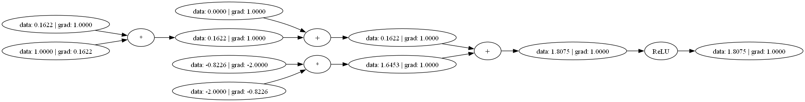

# Micrograd.NET

Micrograd.NET is a .NET port of the [Micrograd](https://github.com/karpathy/micrograd) project, a tiny Autograd engine (with a simple neural net) implemented as a direct port of the original Python code.

## Example usage

```csharp
var a = new Value(-4.0);
var b = new Value(2.0);
var c = a + b;
var d = a * b + b.Pow(3);
c += c + 1;
c += 1 + c + (-a);
d += d * 2 + (b + a).Relu();
d += 3 * d + (b - a).Relu();
var e = c - d;
var f = e.Pow(2);
var g = f / 2.0;
g += 10.0 / f;
Console.WriteLine($"{g.Data}"); // Expected to print: 24.7041
g.Backprop();
Console.WriteLine($"{a.Grad}"); // Expected to print: 138.8338
Console.WriteLine($"{b.Grad}"); // Expected to print: 645.5773
```

## Tracing / visualization
You need to install the `GraphViz` package to visualize the computation graph. You can download it from [here](https://graphviz.gitlab.io/_pages/Download/Download_windows.html).

```csharp
var n = new Neuron(2);
var x = new Value[]{ new Value(1.0), new Value(-2.0) };
var y = n.Call(x);
y.Backward();
await GraphTracer.RenderGraphToImage(y, "neuron.png");
```

